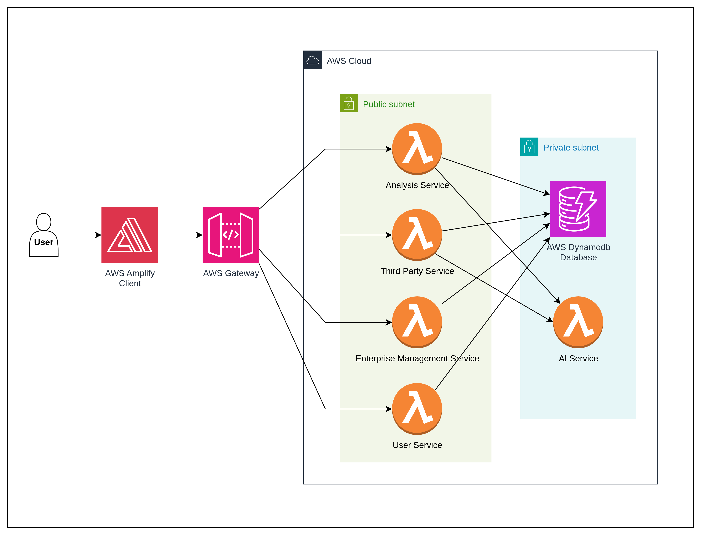
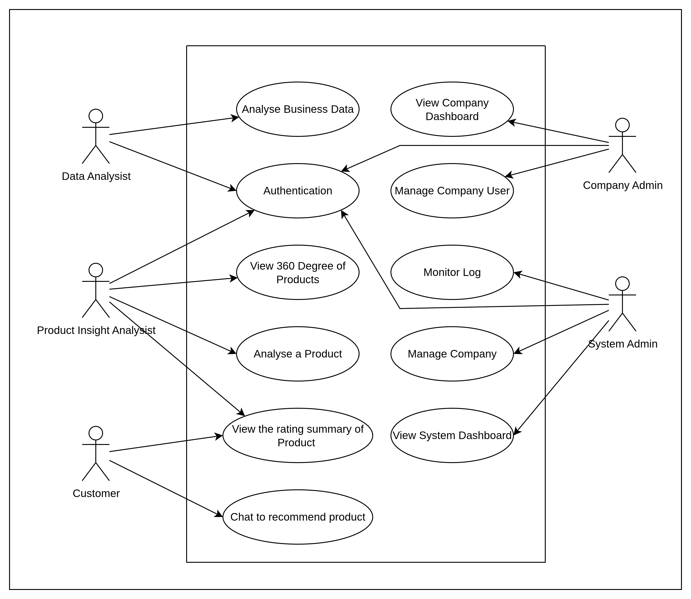
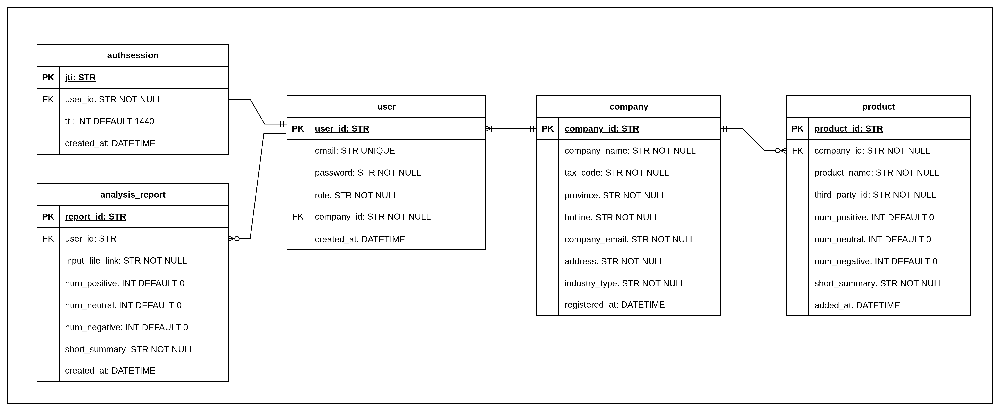

# Cerevex

A production-grade, serverless sentiment analysis platform for Vietnamese text. Built with a modern web stack and AWS-managed services to deliver real-time insights for enterprises.

  
  
  
  
  
  

---

## Table of Contents

- Overview
- Key Features
- System Architecture
- Tech Stack
- Repository Layout
- Getting Started
- Environment Variables
- Development Guide
- Roadmap
- Contributing
- Acknowledgements

## Overview

Cerevex enables organizations to monitor and understand customer sentiment in Vietnamese text at scale. The platform aggregates content across sources, performs preprocessing and model-based inference, and exposes insights via a web app and APIs. The solution is designed as microservices and deployed serverlessly on AWS for elasticity, reliability, and cost efficiency.

## Key Features

- End-to-end sentiment analysis pipeline with AI inference functions.
- Real-time API access via Amazon API Gateway + AWS Lambda.
- Secure multi-tenant data storage with Amazon DynamoDB.
- Web frontend powered by Next.js and distributed by AWS Amplify.
- Private networking with AWS VPC (public/ private subnets) for data services.
- Extensible microservice boundaries: User, Enterprise, Third-Party, Analysis, and AI services.

## System Architecture

High-level deployment on AWS with a split VPC and managed serverless components.

Supporting design artifacts:

- Use Case Model: actors and interactions.

  

- Entity-Relationship Diagram: logical data model for users, companies, products, sessions, and analysis reports.

  

## Tech Stack

- Frontend: Next.js (React) hosted with AWS Amplify.
- Backend services: FastAPI (Python) packaged as AWS Lambda functions.
- API: Amazon API Gateway (REST) routing to Lambda.
- Data: Amazon DynamoDB (NoSQL, scalable, low latency).
- Networking: AWS VPC with Public/Private subnets and least-privilege access.

## Repository Layout

- frontend/ — Next.js application, build configs and static assets.
- services/ — Microservices (FastAPI) intended for Lambda deployment.
  - ai-service/, analysis-service/, enterprise-service/, third-party-service/, user-service/
- docs/ — Architecture, use case and data model diagrams.

## Getting Started

Prerequisites
- Node.js 18+
- Python 3.10+
- AWS account and IAM credentials for deployment (if deploying to cloud)

Install and run frontend
1) cd frontend
2) npm install
3) npm run dev

Set up Python services (example)
1) cd services/user-service
2) python -m venv .venv && source .venv/bin/activate
3) pip install -r requirements.txt
4) uvicorn app.main:app --reload

Core variables (examples – adjust per service):
- AWS_REGION, AWS_ACCESS_KEY_ID, AWS_SECRET_ACCESS_KEY (for deployment and local emulation)
- DYNAMODB_TABLE_PREFIX or table names per service
- Service-specific secrets (OAuth/3rd parties)

Third-party sandbox (example from integration scripts):
- SHOPEE_PARTNER_ID
- SHOPEE_PARTNER_KEY
- SHOPEE_SHOP_ID
- SHOPEE_ACCESS_TOKEN

## Development Guide

- API design: define contracts with OpenAPI in each FastAPI service; keep endpoints small and composable.
- Testing: write unit tests per service and integration tests across boundaries; mock AWS clients where appropriate.
- Observability: emit structured logs and metrics; configure dashboards and alerts for critical paths.
- Security: principle of least privilege (IAM), private subnets for data paths, and secrets management.

## Roadmap

- Data ingestion connectors for more third-party sources.
- Batch analysis jobs for large corpora and scheduled re-scorings.
- Multi-model inference orchestration and A/B evaluation.
- Admin dashboards with trend analytics and real-time alerts.

## Contributing

Contributions are welcome. Please open an issue to discuss changes or propose new features before submitting a PR.

## Acknowledgements

- Next.js, FastAPI and the AWS serverless ecosystem.
- Vietnamese NLP research and PhoBERT-based approaches for sentiment analysis.

---

For diagrams and additional context, see the docs folder above.